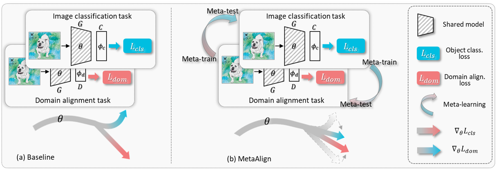

# MetaAlign

This is the official implementation for:
> [**MetaAlign: Coordinating Domain Alignment and Classification for Unsupervised Domain Adaptation**](http://arxiv.org/abs/2004.01888),            
> Guoqiang Wei, Cuiling Lan, Wenjun Zeng, Zhibo Chen,      
> CVPR 2021 | [arXiv](https://arxiv.org/abs/2103.13575)

## Abstract
For unsupervised domain adaptation (UDA), to alleviate the effect of domain shift, many approaches align the source and target domains in the feature space by adversarial learning or by explicitly aligning their statistics. However, the optimization objective of such domain alignment is generally not coordinated with that of the object classification task itself such that their descent directions for optimization may be inconsistent. This will reduce the effectiveness of domain alignment in improving the performance of UDA. In this paper, we aim to study and alleviate the optimization inconsistency problem between the domain alignment and classification tasks. We address this by proposing an effective meta-optimization based strategy dubbed MetaAlign, where we treat the domain alignment objective and the classification objective as the meta-train and meta-test tasks in a meta-learning scheme. MetaAlign encourages both tasks to be optimized in a coordinated way, which maximizes the inner product of the gradients of the two tasks during training. Experimental results demonstrate the effectiveness of our proposed method on top of various alignment-based baseline approaches, for tasks of object classification and object detection.


## Usage

- MetaAlign for [UDA of classification](classification/README.md).
- MetaAlign for [UDA of object detection](detection/README.md).

## Citation

```
@inproceedings{wei2021metaalign,
  title={MetaAlign: Coordinating Domain Alignment and Classification for Unsupervised Domain Adaptation},
  author={Wei, Guoqiang and Lan, Cuiling and Zeng, Wenjun and Chen, Zhibo},
  booktitle={CVPR},
  pages={16643--16653},
  year={2021}
}

```

## Acknowledgement

We borrowed code from [GVB](https://github.com/cuishuhao/GVB) and [DA_Detection](https://github.com/VisionLearningGroup/DA_Detection).


## Contributing

This project welcomes contributions and suggestions.  Most contributions require you to agree to a
Contributor License Agreement (CLA) declaring that you have the right to, and actually do, grant us
the rights to use your contribution. For details, visit https://cla.opensource.microsoft.com.

When you submit a pull request, a CLA bot will automatically determine whether you need to provide
a CLA and decorate the PR appropriately (e.g., status check, comment). Simply follow the instructions
provided by the bot. You will only need to do this once across all repos using our CLA.

This project has adopted the [Microsoft Open Source Code of Conduct](https://opensource.microsoft.com/codeofconduct/).
For more information see the [Code of Conduct FAQ](https://opensource.microsoft.com/codeofconduct/faq/) or
contact [opencode@microsoft.com](mailto:opencode@microsoft.com) with any additional questions or comments.

## Trademarks

This project may contain trademarks or logos for projects, products, or services. Authorized use of Microsoft 
trademarks or logos is subject to and must follow 
[Microsoft's Trademark & Brand Guidelines](https://www.microsoft.com/en-us/legal/intellectualproperty/trademarks/usage/general).
Use of Microsoft trademarks or logos in modified versions of this project must not cause confusion or imply Microsoft sponsorship.
Any use of third-party trademarks or logos are subject to those third-party's policies.
